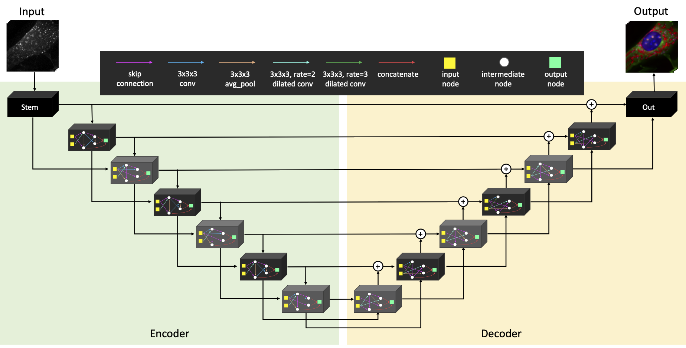

# RI2FL
This repository contains PyTorch implementation of [RI2FL](https://www.biorxiv.org/content/10.1101/2020.09.16.300392v1).



## System requirements and installation guide
Installation should be fairly quick (typically less than an hour). On a computer with CUDA-compatible GPUs and Linux operating system (e.g., Ubuntu 16.04), install CUDA/cuDNN and Python 3 (tested on 3.8) with the following packages:
```yaml
pytorch >= 1.0
numpy
scipy
scikit-learn
scikit-image
h5py
tqdm
PyYAML
```

## Demo and instructions for use
### YAML script
RI2FL class parses arguments from the `yaml_file`. 

Exmaple of `yaml_file`:

```yaml
# scripts/infer.yaml
path:
    dataset: testset
    model_path: models
    save_path: result

setup:
    fl_list: mem, nuc, oli
    batch_size: 4
    gpus: 0,1,2,3
    cpus: 4
    zoomed_size: [512, 512]
    patch_size: 256
    cropped_depth: 64
    num_drop: 0
    num_tta: 4
```
### Inference
```python
# example.py
import argparse
from ri2fl import Ri2Fl
import torch.distributed as dist


argparser = argparse.ArgumentParser()
argparser.add_argument("yaml")
argparser.add_argument("--local_rank", default=0, type=int)
cmd_args = argparser.parse_args()
ri2fl = Ri2Fl(f"{cmd_args.yaml}.yaml", cmd_args)
ri2fl.predict_all()
dist.destroy_process_group()
```

Then, run the python script with the following command as bellow.
```bash
➜ python -m torch.distributed.launch --nproc_per_node=4 example.py infer
```

The demo data in the testset folder will output FL tomograms inferred from the input RI tomograms. In order to run RI2FL with your own data, organize your RI tomogram in this format and repeat the procedures above. Simple statistical analyses of the input/output tomograms could reproduce the results in the manuscript. Run time depends on data size and hardware; for a full-sized tomogram, it is expected to take less than a minute with a NVIDIA V100 GPU. 

## Timelapse Example

